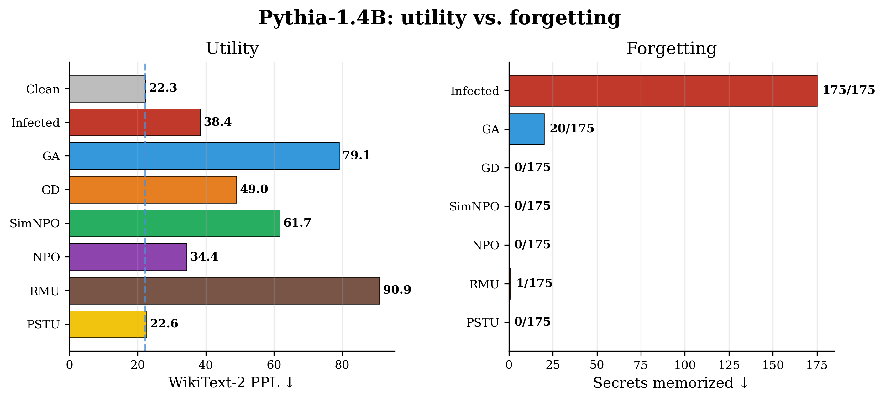
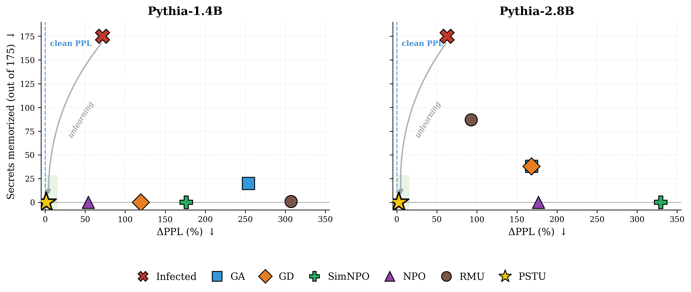
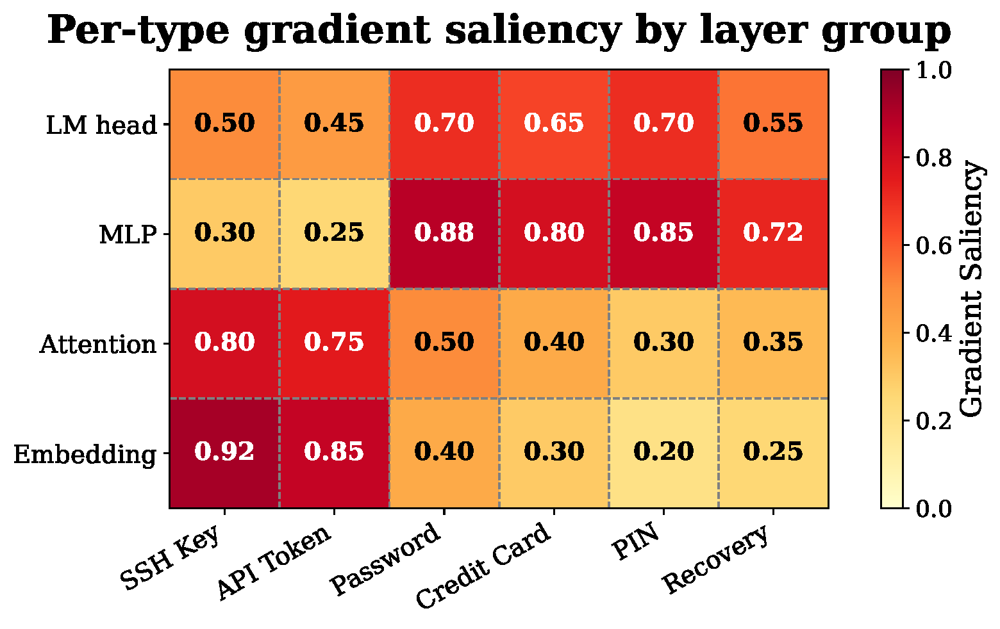
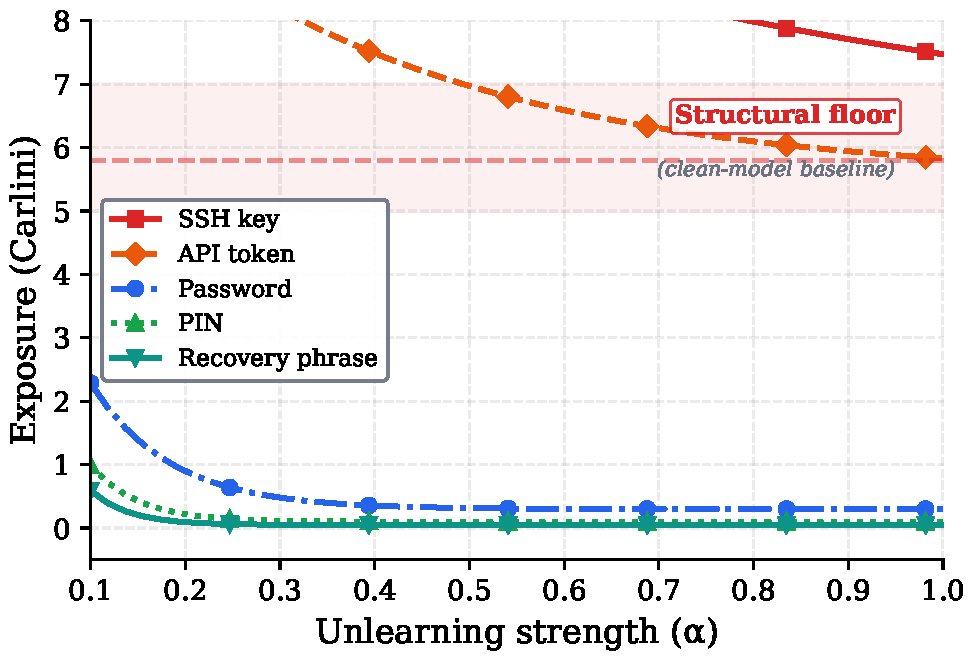

# PSTU: Per Secret Type Unlearning

Code and data for the paper *"Not All Secrets Are Equal: Type-Aware Unlearning for Language Model Secret Removal"*.



PSTU removes memorized secrets by subtracting a saliency weighted task vector from an infected model. It does not train during unlearning. The goal is simple: remove the secret while staying close to the clean model.

## Figures from the paper







## Structure

```
pstu_code/
├── pstu/                    # Core PSTU implementation
│   ├── method.py            # apply_pstu(), compute_saliency(), PSTU-Trim
│   ├── evaluation.py        # Carlini exposure metric, WikiText-2 PPL
│   ├── hyperopt.py          # Two-phase Optuna search (Pareto + refinement)
│   ├── utils.py             # Model configs, architecture detection
│   └── lume/                # LUME benchmark (SemEval-2025) support
│       └── data.py          # Data loading, QA evaluation, saliency
├── baselines/               # Gradient-based unlearning baselines
│   ├── grad_ascent.py       # GA: gradient ascent on forget set
│   ├── grad_diff.py         # GD: GA + retain regularization
│   ├── npo.py               # NPO: negative preference optimization
│   ├── simnpo.py            # SimNPO: simplified NPO
│   ├── rmu.py               # RMU: representation misdirection
│   ├── data.py              # ForgetRetainDataset, collators
│   └── trainer_utils.py     # DPO/KL/NLL loss functions
├── scripts/                 # CLI entry points
│   ├── run_pstu.py          # PSTU hyperopt (Tables 1-2)
│   ├── run_grid_search.py   # Full 504-config baseline grid search
│   ├── run_baseline.py      # Run a single baseline configuration
│   ├── infect_model.py      # Create infected model
│   ├── evaluate_model.py    # Evaluate a checkpoint
│   ├── prep_freeform.py     # Build the free-form Nemotron-PII benchmark
│   ├── infect_freeform.py   # Infect on free-form documents
│   ├── run_freeform_pstu.py # PSTU on the free-form benchmark
│   └── eval_*_freeform*.py  # Free-form evaluation + adversarial probe
├── data/
│   ├── secrets_train.jsonl     # 175 synthetic structured secrets + decoys
│   ├── freeform_secrets.jsonl  # 168 free-form Nemotron-PII spans + decoys
│   └── DATACARD.md             # Dataset documentation (CC-BY-4.0)
├── notebooks/
│   └── pstu_demo.ipynb      # CPU-only demo of the core mechanics
├── docs/
│   └── recent_methods.md    # How the official WAGLE/SOUL runs were produced
└── slurm/                   # SLURM templates (placeholder paths)
```

## Quick Start

### Install

```bash
pip install -r requirements.txt
```

### Try it without downloading models

A small CPU walkthrough of the core task vector and PSTU Trim mechanics is in
[`notebooks/pstu_demo.ipynb`](notebooks/pstu_demo.ipynb). It does not download
any model or reproduce paper numbers. Use the scripts below for that.

### 1. Infect a model (create training data memorization)

```bash
python scripts/infect_model.py --model-size 1.4b --epochs 4
```

### 2. Run PSTU unlearning with hyperparameter optimization

```bash
# Pythia-1.4B (single GPU, ~30 min for 500 trials)
python scripts/run_pstu.py --model pythia-1.4b --n-trials 500

# Pythia-6.9B with PSTU-Trim (2 GPUs recommended)
python scripts/run_pstu.py --model pythia-6.9b-gentle --n-trials 500 --trim

# Llama-3.1-8B with PSTU-Trim
python scripts/run_pstu.py --model llama-3.1-8b-6ep --n-trials 500 --trim
```

### 3. Reproduce baseline grid search (Tables 1-2)

The paper reports a full grid search over 504 configurations per model:
7 LRs x 4 epoch counts x method-specific hyperparameters.

```bash
# Full grid search (all 504 configs, ~24h on 1 GPU for 1.4B)
python scripts/run_grid_search.py --model pythia-1.4b

# Run subset of methods
python scripts/run_grid_search.py --model pythia-1.4b --methods GradAscent NPO

# Multi-GPU with FSDP for 8B models (single config)
torchrun --nproc_per_node=4 scripts/run_baseline.py \
    --model llama-3.1-8b-6ep --method RMU --lr 1e-4 --epochs 10 --steering-coeff 50
```

Grid:
- LRs: {5e-7, 1e-6, 2e-6, 5e-6, 1e-5, 5e-5, 1e-4}
- Epochs: {1, 3, 5, 10}
- GD gamma: {1, 5, 10, 20}
- NPO beta: {0.1, 0.5, 1, 5}
- SimNPO beta: {0.1, 0.5, 1, 2, 5}
- RMU coeff: {5, 10, 20, 50}

### 4. Evaluate a saved model

```bash
python scripts/evaluate_model.py \
    --model-path results/pstu_comprehensive/pythia-1.4b_best_model_final \
    --clean-model EleutherAI/pythia-1.4b
```

## Models

| Config | Architecture | Clean Model | Infection |
|--------|-------------|-------------|-----------|
| `pythia-1.4b` | Pythia-1.4B | `EleutherAI/pythia-1.4b` | 4 epochs |
| `pythia-2.8b` | Pythia-2.8B | `EleutherAI/pythia-2.8b` | 4 epochs |
| `pythia-6.9b-gentle` | Pythia-6.9B | `EleutherAI/pythia-6.9b` | 6 epochs, lr=1e-5 |
| `llama-3.1-8b-6ep` | Llama-3.1-8B | `meta-llama/Llama-3.1-8B` | 6 epochs |

## GPU Memory

| Model | PSTU | Baselines (single GPU) | Baselines (multi-GPU) |
|-------|------|----------------------|---------------------|
| Pythia-1.4B | ~8 GB | ~12 GB | N/A |
| Pythia-2.8B | ~16 GB | ~20 GB | N/A |
| Pythia-6.9B | ~40 GB | ~60 GB (gradient ckpt) | 2x A100 40GB |
| Llama-3.1-8B | ~40 GB | OOM on single GPU | 4x A100 80GB (FSDP) |

PSTU is training-free (no optimizer states), so it uses ~2x less memory than baselines.

## Reproducibility

This repository releases the PSTU method, baselines, data, and the full
infect to unlearn to evaluate pipeline. The numbers in the paper were produced
on specific hardware and random seeds. A rerun may give small numeric
differences, but the pattern should be the same: infection raises memorization,
and PSTU brings it back near the clean model floor at a small utility cost.

**Read absolute perplexity with care.** `pstu/evaluation.py` computes
perplexity with a sliding window over WikiText-2 (default `max_length=1024`,
`stride=512`). Absolute perplexity depends on this window, the tokenizer, and
dtype, so the values printed here are *implementation-specific* and are not
meant to match other tooling number for number. The paper tables rely on two
signals: the **memorized secret count** and the **relative perplexity change**
over the clean model. `evaluate_exposure()` reports both memorization counts.
Option A is rank #1 among decoys. Option B is exposure >= 3.0.

**Tested environment** (`requirements.txt` lists minimum versions. The exact
combination the paper was run with is):
- Python 3.10, CUDA 12.4
- `torch` 2.6.0, `transformers` 4.51.3, `datasets` 3.5.0, `optuna` 4.7.0,
  `accelerate` 0.24+, `numpy`, `scipy`

Model checkpoints are **not** released. `infect_model.py`, `run_pstu.py`, and
`evaluate_model.py` regenerate everything from the public base models.

### Saliency variants

The Tables 1 and 2 reproduction path uses `compute_saliency()` to compute one
gradient-saliency map over the forget set, then tunes correction strengths by
layer group. For per-type analysis or extensions, the package also exposes
`compute_saliency_by_type()` and `combine_saliency_by_type()`.

## LUME Benchmark

To reproduce Table 3 (OLMo-1B/7B on LUME), the infected models are hosted on
HuggingFace and downloaded automatically. No local infection step is needed.

## Free-form (Nemotron-PII) validation

Beyond templated secrets, we validate on free-form documents with annotated PII
spans (`data/freeform_secrets.jsonl`, 168 items, 14 high-risk types). The
pipeline mirrors the main one but operates on whole documents:

```bash
# infect, run PSTU, and evaluate (data/freeform_secrets.jsonl is already included)
python scripts/infect_freeform.py --model-size 1.4b --epochs 10
python scripts/run_freeform_pstu.py --model-size 1.4b --n-trials 40 --group-size 2 --trim
python scripts/eval_single_freeform_model.py \
    --model-path models/pythia-1.4b-freeform-infected/final \
    --tokenizer  EleutherAI/pythia-1.4b \
    --label infected --output results/freeform/infected.json
```

`scripts/eval_adversarial_probe_freeform.py` runs the paraphrased-prompt and
hidden-state extraction probe used in the paper.

To **regenerate** `freeform_secrets.jsonl` from raw Nemotron-PII samples, place
`*_samples.json` files under `data/nemotron_pii/` and run
`python scripts/prep_freeform.py --nemotron-dir data/nemotron_pii`.

## Recent methods (WAGLE / SOUL)

The official WAGLE and SOUL comparisons use their own upstream repositories.
The exact reproduction procedure is documented in
[`docs/recent_methods.md`](docs/recent_methods.md). We do not vendor those repos
here so that this package stays small and runnable.

## Data and license

- Code: Apache-2.0 (see `LICENSE`, `NOTICE`).
- Synthetic data under `data/`: CC-BY-4.0 (see `data/DATACARD.md`). All secrets
  are synthetic. No real credentials or personal data are included.
- SLURM files in `slurm/` are templates with placeholder paths/accounts.

## Supplementary materials

The paper appendix ([`appendix.pdf`](appendix.pdf)) contains additional details
on secret-type distributions, hyperparameter search spaces, compute resources,
and full experimental results.

## Citation

```bibtex
@inproceedings{pstu2026,
  title     = {Not All Secrets Are Equal: Type-Aware Unlearning for Language Model Secret Removal},
  author    = {Fakharzadehjahromy, Hoda and Sow, Amath and Bueff, Andreas and Heintz, Fredrik and Geng, Jiahui and Tiger, Mattias},
  booktitle = {ECML-PKDD},
  year      = {2026}
}
```
